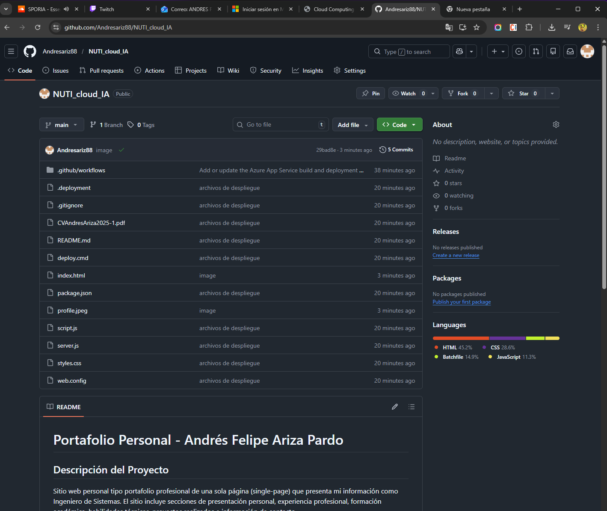

# Documentación del Proyecto - Portafolio Personal

## 1. Información del Estudiante

**Nombre completo:** Andrés Felipe Ariza Pardo  
**Matrícula:** [Tu matrícula aquí]  
**Programa:** Ingeniería de Sistemas  
**Universidad:** Universidad Escuela Colombiana de Ingeniería Julio Garavito

---

## 2. URLs del Proyecto

### Repositorio de GitHub
🔗 **[https://github.com/Andresariz88/NUTI_cloud_IA](https://github.com/Andresariz88/NUTI_cloud_IA)**

### Sitio Web Publicado en Azure
🌐 **[https://cv-aariza-eugphaeqbaggfteq.eastus-01.azurewebsites.net/index.html](https://cv-aariza-eugphaeqbaggfteq.eastus-01.azurewebsites.net/index.html)**

---

## 3. Capturas de Pantalla

### 3.1 Repositorio de GitHub



*Captura mostrando la estructura del proyecto en GitHub con todos los archivos (index.html, styles.css, script.js, server.js, package.json, etc.)*


---

### 3.2 Panel de Azure App Service


*Captura del panel de Azure mostrando el App Service en estado "Running" con la configuración del recurso*

**Instrucciones para captura:**
- Accede a Azure Portal (portal.azure.com)
- Navega a tu App Service
- Captura la vista general mostrando:
  - Estado: Running
  - URL del sitio
  - Plan de App Service
  - Grupo de recursos

---

### 3.3 Sitio Web Funcionando


*Captura del sitio web funcionando correctamente en el navegador, mostrando la página de inicio con información personal*


---

### 3.4 Capturas Adicionales (Opcional)


*Vista de la sección de experiencia profesional*


*Vista de la sección de habilidades técnicas*

---

## 4. Reflexión sobre el Proyecto

### Desafíos Enfrentados

Durante el desarrollo y despliegue de este proyecto, enfrenté varios desafíos significativos. El primero fue comprender la arquitectura necesaria para desplegar un sitio web estático en Azure App Service, ya que inicialmente consideré usar Azure Static Web Apps, pero opté por App Service para tener mayor control sobre el servidor. La configuración del archivo `web.config` para IIS y el script `deploy.cmd` requirió investigación adicional para entender cómo Azure maneja el despliegue automático.

Otro desafío importante fue optimizar el sitio para que fuera completamente responsivo y accesible, asegurando que funcionara correctamente en diferentes dispositivos y navegadores. La implementación de animaciones suaves con JavaScript y el uso de Intersection Observer API para detectar elementos visibles en el viewport fue un proceso de aprendizaje valioso.

### Aprendizaje sobre Servicios en la Nube

Este proyecto me permitió comprender profundamente cómo funcionan los servicios en la nube, específicamente Azure App Service. Aprendí sobre conceptos fundamentales como:

- **Escalabilidad**: Cómo los servicios en la nube permiten escalar recursos según la demanda
- **Despliegue continuo**: La integración con GitHub para automatizar el proceso de despliegue
- **Monitoreo**: Las herramientas que Azure proporciona para supervisar el rendimiento y disponibilidad

Además, comprendí la diferencia entre servicios PaaS (Platform as a Service) como App Service y servicios más simples como Static Web Apps, y cuándo es apropiado usar cada uno.

### Aplicación en Proyectos Futuros

Los conocimientos adquiridos son directamente aplicables a proyectos profesionales futuros. En mi rol como Ingeniero de Sistemas, podré:

1. **Desplegar aplicaciones empresariales**: Utilizar Azure App Service para hospedar aplicaciones web más complejas con backend en Node.js, Java o .NET
2. **Implementar CI/CD**: Configurar pipelines de integración y despliegue continuo para automatizar el proceso de desarrollo
3. **Arquitectura de microservicios**: Aplicar estos conceptos para desplegar múltiples servicios que se comuniquen entre sí
4. **Optimización de costos**: Entender cómo seleccionar el plan de servicio adecuado según las necesidades del proyecto

Este proyecto también reforzó la importancia de la documentación técnica y las buenas prácticas de desarrollo, aspectos fundamentales en cualquier proyecto profesional de software.

---

## 5. Tecnologías y Herramientas Utilizadas

- **Frontend**: HTML5, CSS3, JavaScript (ES6+)
- **Backend**: Node.js, Express.js
- **Cloud**: Microsoft Azure App Service
- **Control de versiones**: Git, GitHub
- **Herramientas de desarrollo**: Visual Studio Code, Azure CLI
- **Metodología**: Desarrollo web responsivo, Mobile-first design

---

## 6. Instrucciones para Reproducir el Proyecto

### Requisitos Previos
- Node.js 18 o superior
- Cuenta de Azure (con créditos estudiantiles si aplica)
- Git instalado
- Azure CLI (opcional pero recomendado)

### Pasos de Instalación

1. **Clonar el repositorio**
   ```bash
   git clone https://github.com/tu-usuario/portafolio-personal.git
   cd portafolio-personal
   ```

2. **Instalar dependencias**
   ```bash
   npm install
   ```

3. **Ejecutar localmente**
   ```bash
   npm start
   ```
   El sitio estará disponible en `http://localhost:8080`

4. **Desplegar a Azure**
   ```bash
   az login
   az webapp up --name tu-app-name --resource-group tu-grupo
   ```

---

## 7. Conclusiones

Este proyecto representa una implementación exitosa de un portafolio personal profesional desplegado en la nube. Demuestra competencias en desarrollo web frontend, configuración de servidores backend básicos, y despliegue en plataformas cloud modernas. La experiencia adquirida es fundamental para mi desarrollo profesional como Ingeniero de Sistemas y será aplicable en proyectos empresariales futuros.

---

**Fecha de entrega:** [Fecha aquí]  
**Curso:** [Nombre del curso]  
**Profesor:** [Nombre del profesor]
